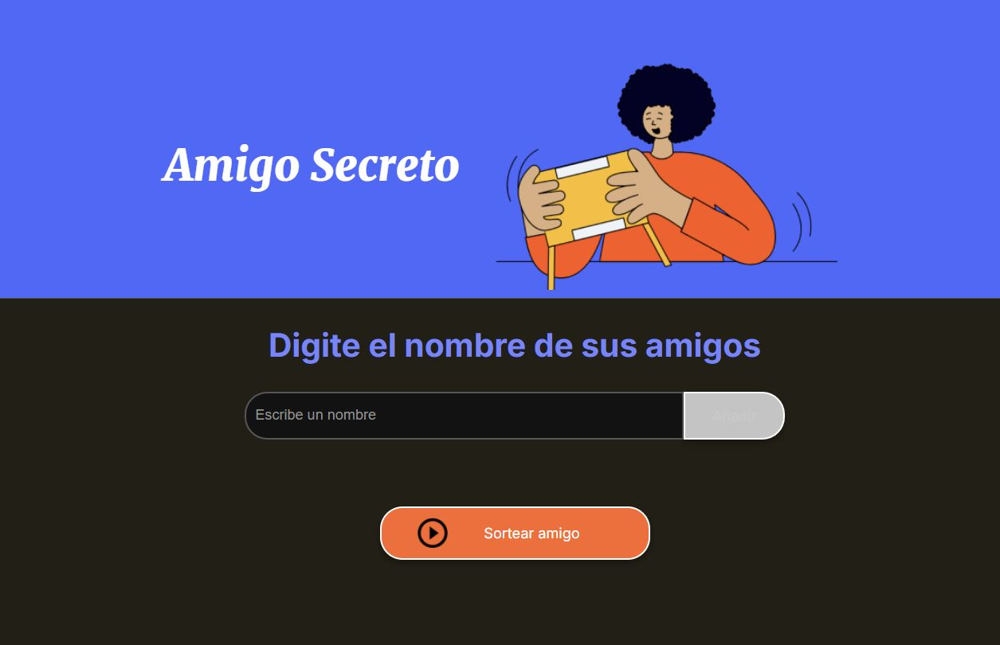

## CHALLENGE AMIGO SECRETO 

#### DESCRIPCION DEL PROYECTO
El proyecto consiste en agregar un grupo de amigos uno por uno y luego al dar click al botón **"sortear amigo"** escoge aleatoriamente un amigo de la lista

#### FUNCIONES Y APLICACIONES
Ayuda a establecer un amigo secreto aleatorio de una lista.

#### PARA CLONAR EL REPOSITORIO 
Git clone https://github.com/8SuperNova8/ChallengerOracle.git  
y abrir el archivo index dentro de la carpeta challenge-amigo-secreto_esp-main

#### TECNOLOGIAS USADAS
HTML, CSS y JavaScript

